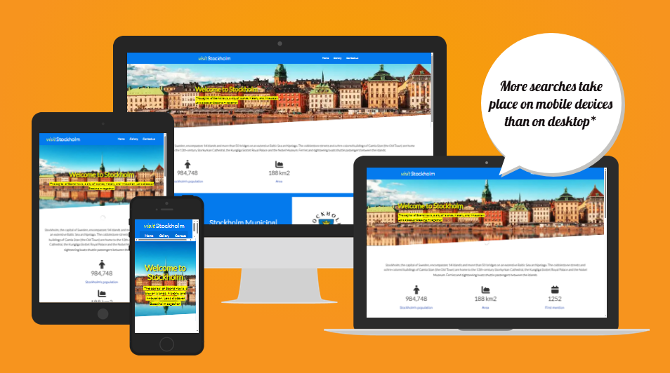
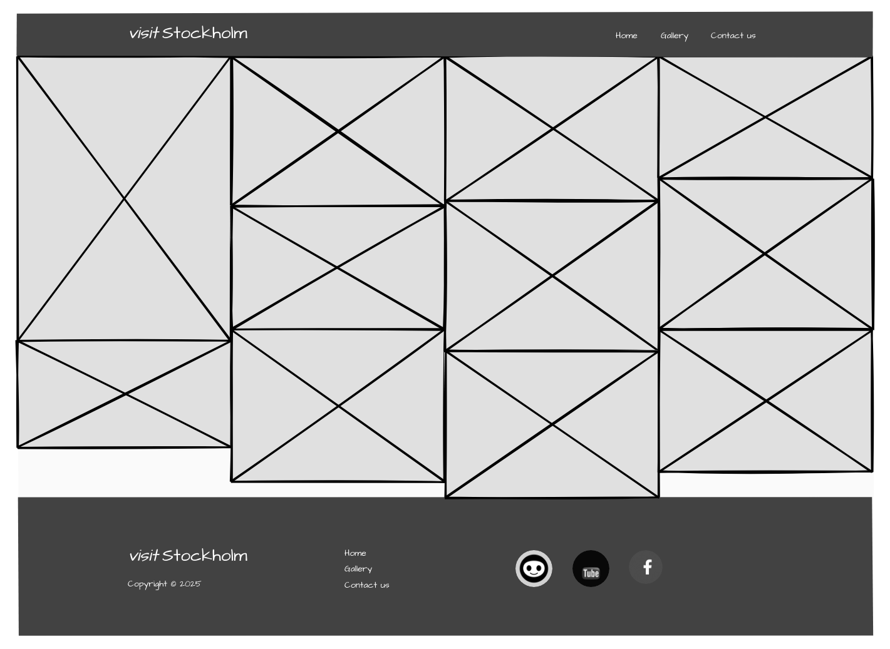

# <mark>Visit Stockholm</mark>
A static website created by using html and css programming languages and this website gives a simple overview about Sweden capital Stockhoml.

**Link to visit website**
[visitStockholm](https://dhiaa-alomari.github.io/visit-stockholm/)
 
The project deployed on Github Pages.

## I am Responsive
*  On most devices it is responsive.
 

## Languages

* HTML
* CSS
---
## Screenshots
Includes three pages [Home-Gallery-Contactus]
  Below Screenshots for website on desktop and mobile:
1.  Home page:
 

 

      

2. Gallery page:
 

 

 
  
3. Contact us page:
 

 

 

## Wireframe
*   <u>Desktop Design:</u>
1. Home Page:
 

 
2. Gallery page:
 

 
3.  Contact us page:
 

 

*  <u>Mobile Design:</u>
1.  Home page:
 

 
2.  Gallery page:
 

 
3.  Contact Page:
 

 
      
## CSS & HTML codes are tested
*  All the codes in the project are tested in service [**<u>W3C CSS & HTML Validator</u>**]

*  <u>HTML files tested:</u>
1.  index.html:
 

 
2.  gallery.html:
 

 
3.  _contactus.html_:
 

  

*  <u>CSS files tested :</u>
1.  index.css:
 

 

* <u>Website tested at Lighthouse in Chrome browser:</u>
 
| Performance | Accessibility | Best Prctice | SEO |
  

## User Stories

As a visitor to the website, I want to...

*   **As a** tourist planning a trip to Stockholm, **I want to** see the top attractions and learn about them, **so that I can** plan my itinerary easily.
*   **As a** visual person, **I want to** browse a gallery of high-quality photos of Stockholm, **so that I can** get a sense of the city's beauty and feel inspired.
*   **As a** website visitor who has a question, **I want to** find a clear "Contact Us" page, **so that I can** get in touch with the site administrator.
*   **As a** new visitor to the site, **I want to** find a welcoming introduction to Stockholm on the homepage, **so that I can** quickly understand what the city has to offer.
*   **As someone** looking for inspiration, **I want to** view beautiful photos of different Stockholm locations in the gallery, **so that I can** discover new places to visit.

##  Debug
1.  <u>Open social media links not in new tab</U>

Add target="_blank" attribute to the anchor HTML elements for social media icons in the footer section. This ensures that users can follow social media accounts without leaving the main website.

2.  <u>Footer of contact-us page not stay at bottom of the page</u>

Make the height of main section min-height:100vh so footer section will always stay at bottom of the page.

3.  <u>Increase images quality in gallery page and home page</u>

Use AI tool to upscaling: https://imgupscaler.ai.

4.  <u>Contrast between text and background color was not perfect</u>

Change background color from light blue to dark blue.

## Deployment

### GitHub Pages

The site was deployed to GitHub pages. The steps to deploy are as follows: 
1. In the GitHub repository, navigate to the Settings tab 
2. From the left hand menu select 'Pages'
3. From the source select Branch: main
4. Click 'Save'
5. A live link will be displayed when published successfully. 

The live link can be found here - [visitStockholm](https://dhiaa-alomari.github.io/visit-stockholm/)

### Forking the GitHub Repository

You can fork the repository by following these steps:
1. Go to the GitHub repository
1. Click on Fork button in upper right hand corner

### Cloning the GitHub Repository

You can clone the repository to use locally by following these steps:
1. Navigate to the GitHub Repository you want to clone
2. Click on the code drop down button
3. Click on HTTPS
4. Copy the repository link to the clipboard
5. Open your IDE of choice (git must be installed for the next steps)
6. Type git clone copied-git-url into the IDE terminal

The project will now be cloned locally for you to use.

##  Attributions

### Images and fonts

*  Images from Wikipedia. 
*  fonts from Google Fonts.
*  Icons from Fontawesome.

### Info and text

* Wikipedia.

### Debugs and some instructions for coding
* Some bugs fixed by Chatgpt.

### Inspiration
* [https://www.visitstockholm.com/](https://www.visitstockholm.com/)

